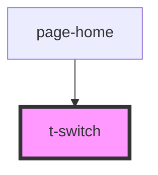

# t-switch

<!-- Auto Generated Below -->

## Properties

| Property  | Attribute | Description | Type      | Default |
| --------- | --------- | ----------- | --------- | ------- |
| `checked` | `checked` |             | `boolean` | `false` |

## Events

| Event    | Description | Type                   |
| -------- | ----------- | ---------------------- |
| `switch` |             | `CustomEvent<boolean>` |

## Dependencies

### Used by

 - [page-home](../../pages/page-home)

### Graph

----------------------------------------------

*Built with [StencilJS](https://stenciljs.com/)*
