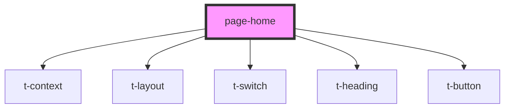

# page-home

<!-- Auto Generated Below -->

## Dependencies

### Depends on

- [t-context](../../components/t-context)
- [t-layout](../../components/t-layout)
- [t-switch](../../components/t-switch)
- [t-heading](../../components/t-heading)
- [t-button](../../components/t-button)

### Graph

----------------------------------------------

*Built with [StencilJS](https://stenciljs.com/)*
