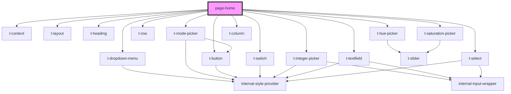

# page-home

<!-- Auto Generated Below -->

## Dependencies

### Depends on

- [t-context](../../components/t-context)
- [t-layout](../../components/t-layout)
- [t-heading](../../components/t-heading)
- [t-dropdown-menu](../../components/t-dropdown)
- [t-mode-picker](../../components/t-mode-picker)
- [t-row](../../components/t-row)
- [t-switch](../../components/t-switch)
- [t-hue-picker](../../components/t-hue-picker)
- [t-saturation-picker](../../components/t-saturation-picker)
- [t-integer-picker](../../components/t-integer-picker)
- [t-button](../../components/t-button)
- [t-column](../../components/t-column)
- [t-textfield](../../components/t-textfield)
- [t-select](../../components/t-select)

### Graph

----------------------------------------------

*Built with [StencilJS](https://stenciljs.com/)*
